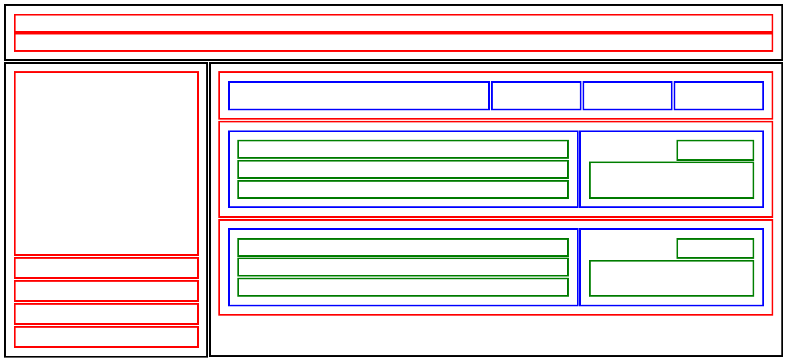
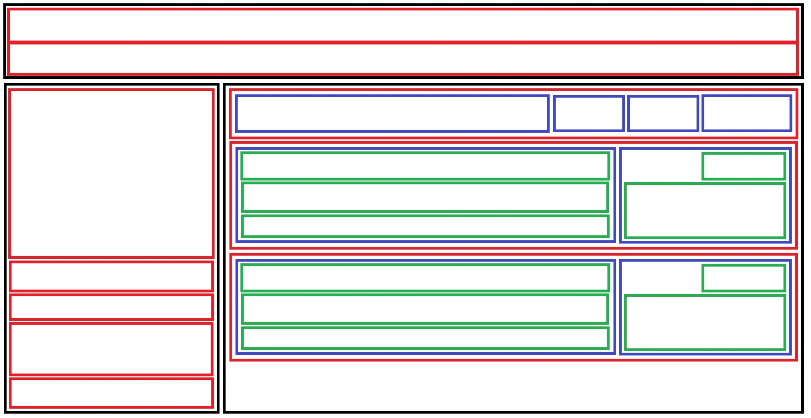

# Introduction

This challenge focuses on building a complex UI layout using nested Flexbox containers.
The goal was to create a responsive, maintainable structure using BEM for semantic class naming, nested flex layouts, flex ratios, axis control, and alignment techniques.

## Intended Folder Structure

```bash
challenge-02/
│
├── images/          
├── index.html       
├── style.css        
└── README.md     
```

## Preview

### Final Output



### Reference Design



## Features

- Nested Flexbox layout
- BEM naming methodology
- Responsive design
- Proper alignment using flex properties
- Flex-grow and flex ratios implementation
- Clean and maintainable CSS structure

## Technologies Used

- HTML5
- CSS3
- Flexbox

## What I Learned

- How to create complex layouts using nested flex containers
- How to control main axis and cross axis
- Better understanding of flex-grow, flex-basis, and alignment
- Writing scalable CSS using BEM methodology

## How to Run

1. Clone the repository
2. Open index.html in your browser

## Main Files

- [index.html](./index.html)
- [style.css](./style.css)
